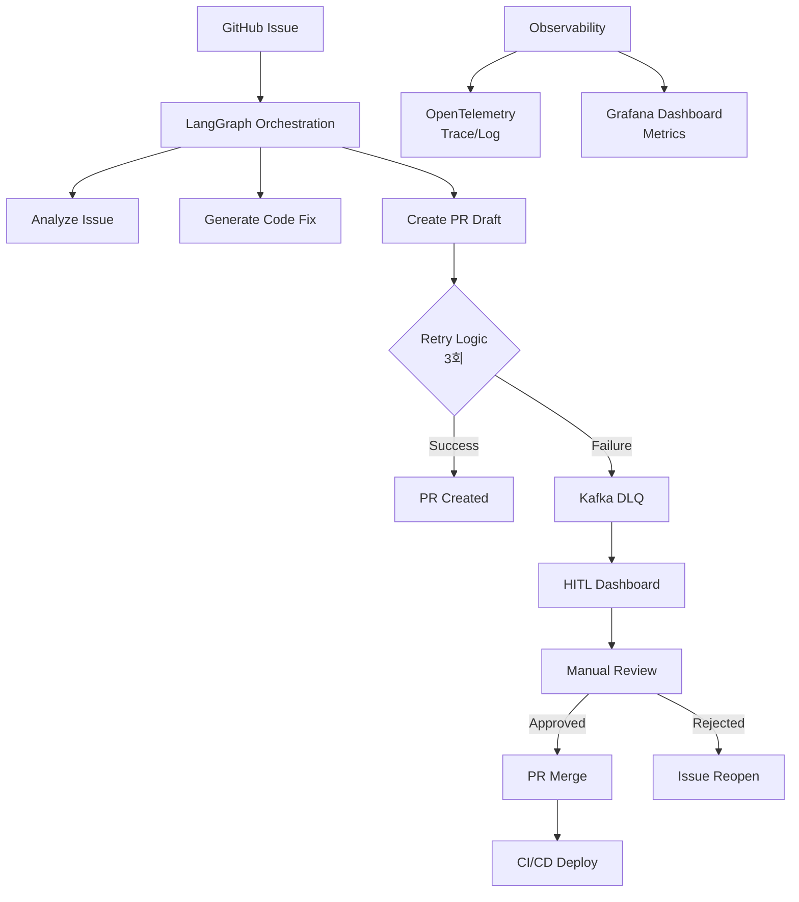

# Issue Tracker PoC (with LangGraph)

## Purpose

이 프로젝트의 목적은 **실무 환경에서도 안전하고 확장 가능한 AI 자동화 워크플로우**를 구현하는 것입니다.  
단순한 코드 생성 예제를 넘어서, 다음과 같은 **엔드투엔드 패턴**을 제공합니다:

- **이슈 → AI 기반 분석 및 코드 수정 → 자동 Pull Request 생성**
- **실패 시 재시도 및 Kafka DLQ 격리 처리**
- **Human-in-the-Loop(HITL) 검수 및 승인 프로세스**
- **Observability(OpenTelemetry, Grafana) 기반 실시간 모니터링**
- **Kubernetes 기반 확장성과 안정성 확보**

이를 통해 GitHub Copilot Workspace와 유사하지만,  
👉 **실제 운영 환경에서도 바로 적용 가능한 고도화된 레퍼런스 아키텍처**를 목표로 합니다.

## Architecture

## Quickstart

### 1. Clone & Setup

git clone https://github.com/riverfrot/issue-tracker.git
cd issue-tracker

### 2. Start Infrastructure
docker compose up -d
Kafka → localhost:9092

SCDF Dashboard → http://localhost:9393/dashboard

Grafana → http://localhost:3000

### 3. Register & Deploy Stream in SCDF
dataflow shell
dataflow:>stream create --name workflowStream \
  --definition "trigger-topic: kafka --destination=workflow-events | processor: workflow-processor | sink: kafka --destination=workflow-processed"

dataflow:>stream deploy workflowStream

### 4. Run Backend (Spring Boot, Kotlin)
./gradlew bootRun
/trigger API 호출 → Kafka workflow-events 토픽에 메시지 publish

SCDF가 workflow-processor 스트림에서 변환 후 workflow-processed 토픽에 전달

### 5. Run LangGraph Worker (Python)
cd langflow
python example_flow.py
workflow-events 구독

처리 실패 시 DLQ 토픽으로 메시지 이동

### 6. Check DLQ
docker exec -it kafka kafka-console-consumer \
  --bootstrap-server localhost:9092 \
  --topic dlq \
  --from-beginning